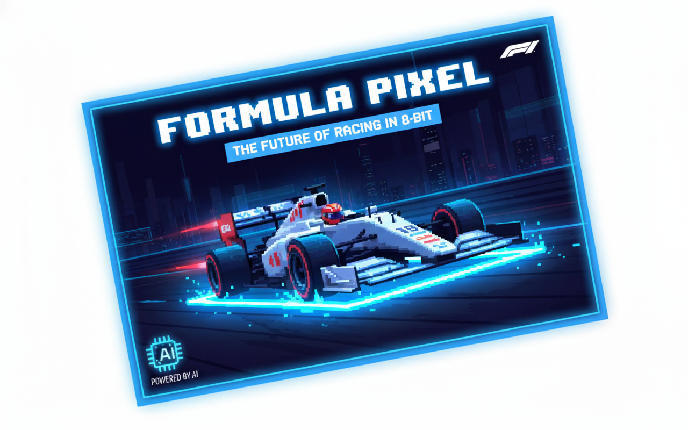

    

# Projeto EBOOK Gerado por I.A.s

Projeto com o objetivo de gerar um ebook digital com as facilidades das ferramentas de IA. 

## 💻 Tecnologias utilizadas no projeto

- [ChatGPT](https://chat.openai.com/) 
- [Gemini](https://gemini.google.com/app)
- [LibreOficce](https://pt-br.libreoffice.org/)

## 🧠 Prompts

ChatGPT：

|   Ação   | prompt                                                                                                                                                                                                                                                                         |
| :------: | ------------------------------------------------------------------------------------------------------------------------------------------------------------------------------------------------------------------------------------------------------------------------------ |
|  título  | Crie um título de um ebook sobre o tema de fórmula 1, o ebookk é do nicho de motosports e o subnicho é de fórmula 1, o título deve ser épico e curto, me liste 5 variações de títulos                                                        |
| conteúdo | Faça um texto para ebook , com foco em Fórmula 1, listando os principais pilotos {REGRAS} Explique sempre de uma maneira simples Deixe o texto enxuto, Sempre traga exemplos de código em contextos reais , sempre deixe um título sugestivo por tópico |

## ✨ Features

- Conteúdo gerado via ChatGPT
- Imagens geradas via Gemini

## 🛠️ Instruções de execução

Utilize os prompts acima nas ferramentas sugeridas para gerar o material base e utilize uma ferramenta de edição de documentos como power point, libreoffice , indesign para diagramação.
